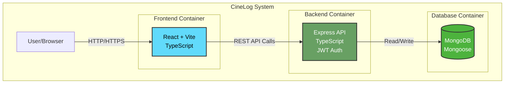
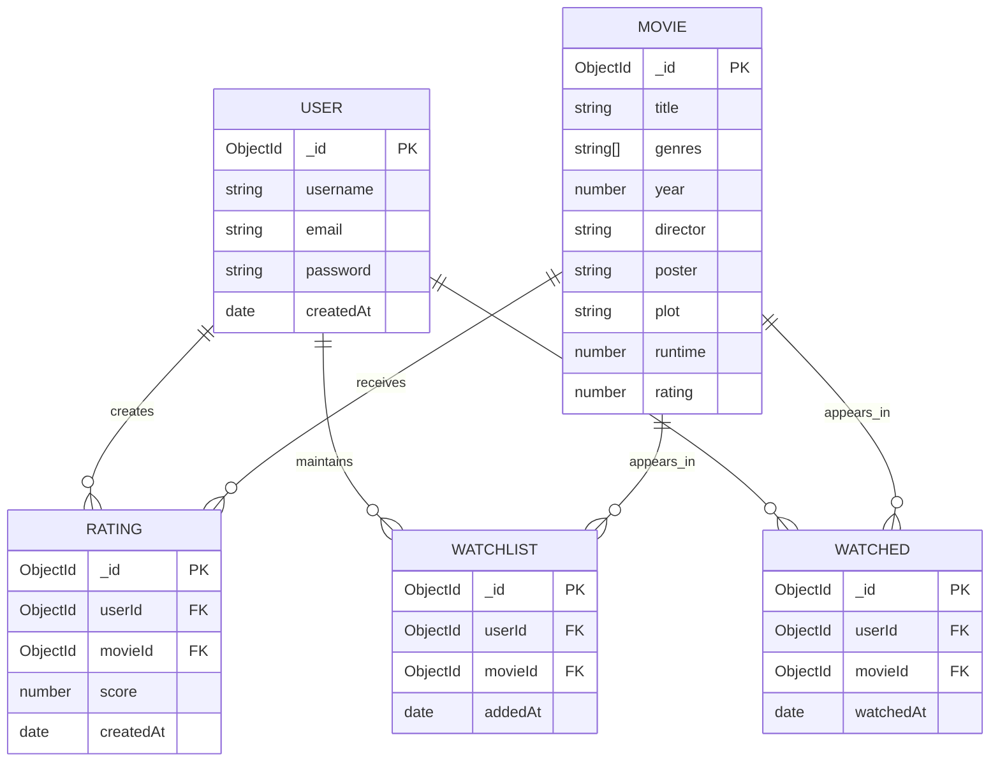
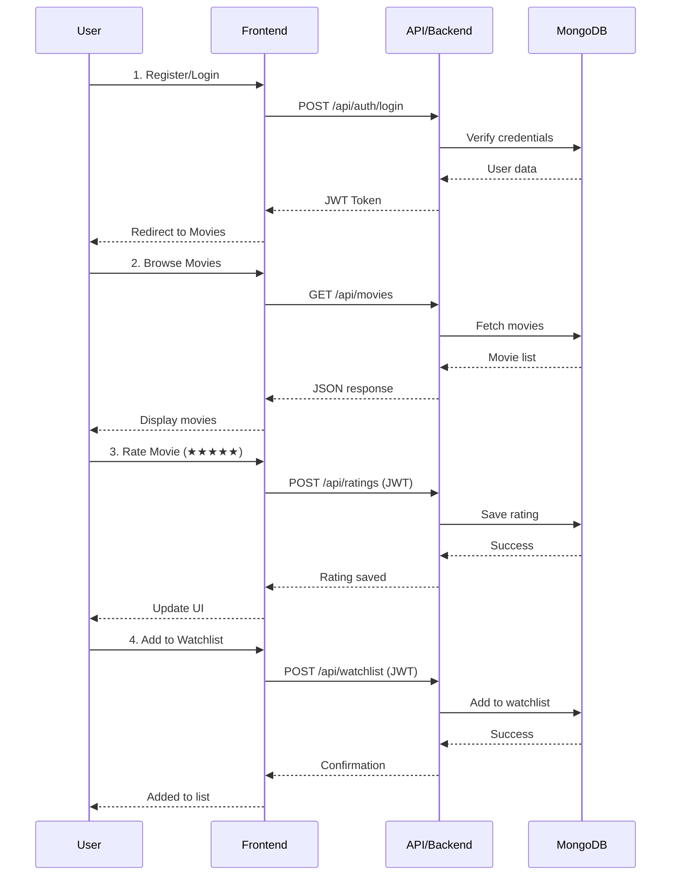
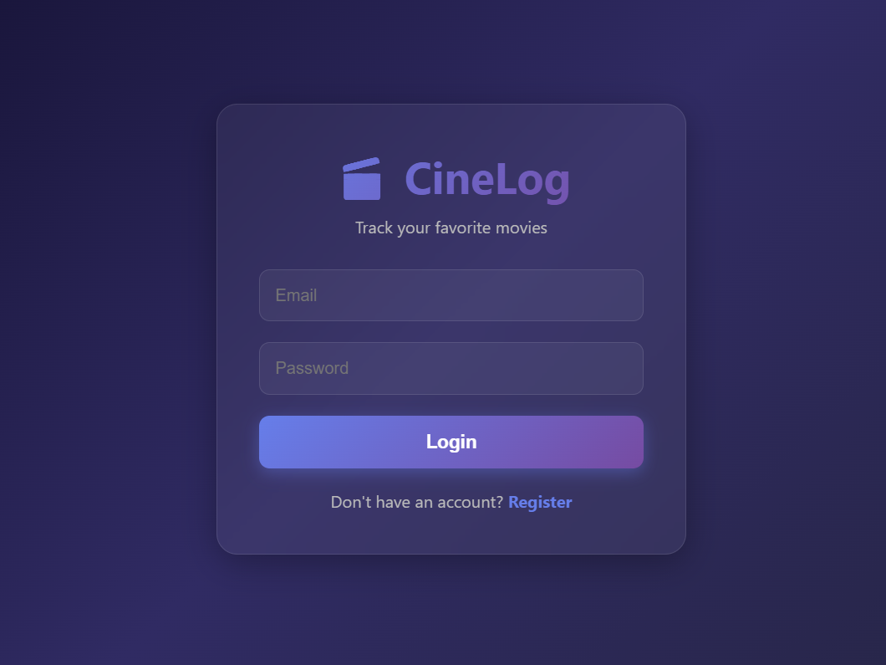
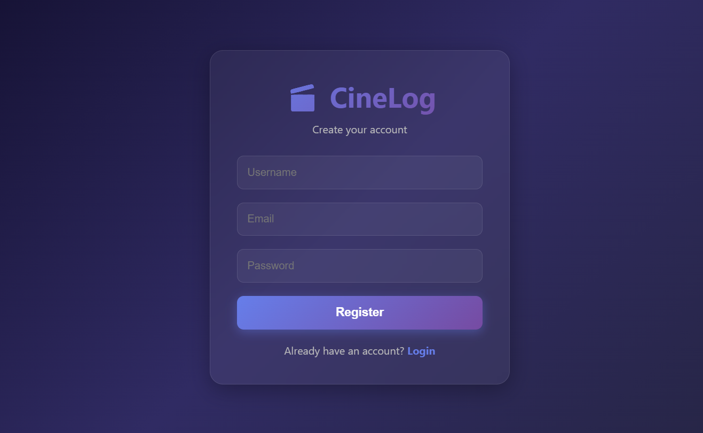
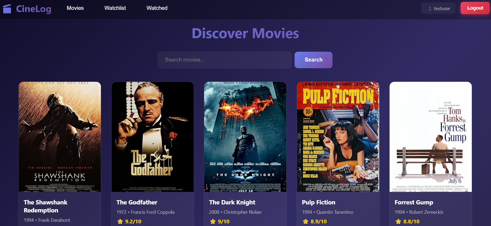
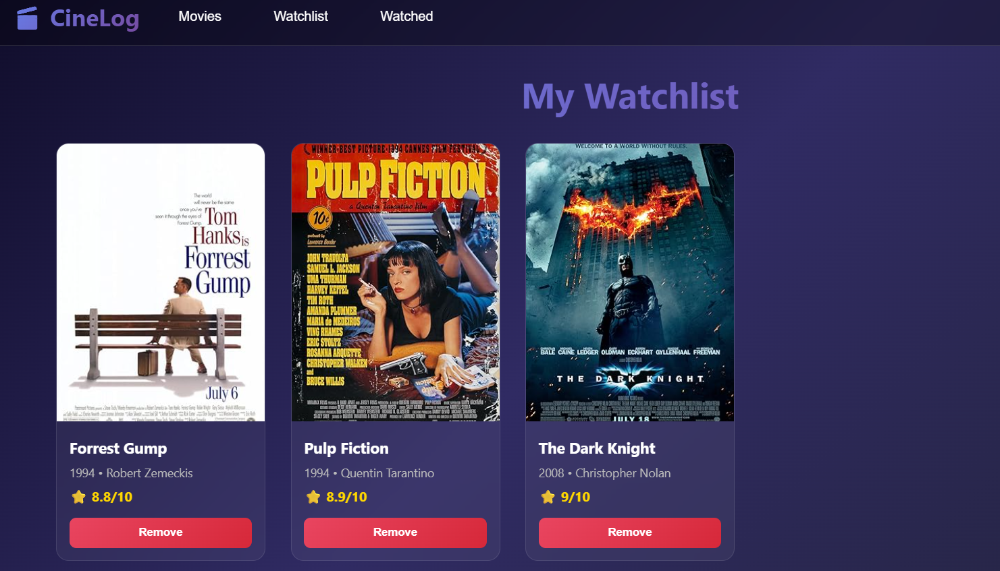
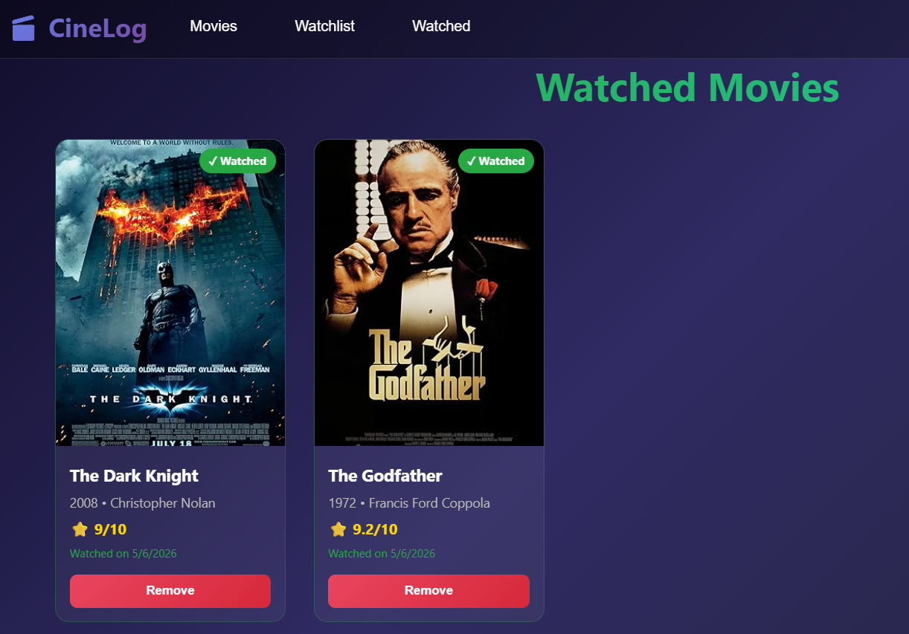

# 🎬 CineLog - Movie Tracking Application

A full-stack movie tracking application built with React, Express, MongoDB, and Docker. Track your favorite movies, create watchlists, rate films, and manage your viewing history.


---

## 📋 Features

- **User Authentication** - Secure registration and login with JWT
- **Browse Movies** - Explore a curated collection of movies
- **Search** - Find movies by title, director, or genre
- **Rate Movies** - Give movies a 1-10 star rating
- **Watchlist** - Save movies to watch later
- **Watched List** - Track movies you've already seen
- **Responsive Design** - Beautiful UI that works on all devices

---

---

## 👥 User Stories

### Authentication
- **As a new user**, I want to register an account so that I can start tracking movies
- **As a registered user**, I want to log in securely so that I can access my personal movie lists
- **As a logged-in user**, I want to log out so that my account stays secure

### Movie Discovery
- **As a movie enthusiast**, I want to browse all available movies so that I can discover new films
- **As a user**, I want to search for movies by title, director, or genre so that I can quickly find specific films
- **As a user**, I want to view detailed information about a movie so that I can decide if I want to watch it

### Rating & Reviews
- **As a user**, I want to rate movies on a 1-10 scale so that I can remember how much I enjoyed them
- **As a user**, I want to see my previous ratings so that I can track my preferences over time

### List Management
- **As a user**, I want to add movies to my watchlist so that I can remember films I want to see
- **As a user**, I want to mark movies as watched so that I can track what I've already seen
- **As a user**, I want to remove movies from my lists so that I can keep them organized
- **As a user**, I want to see all my watchlist and watched movies in one place so that I can manage my viewing easily

---

## 🛠️ Tech Stack

### Frontend
- **React** - UI library
- **TypeScript** - Type-safe JavaScript
- **Vite** - Fast build tool
- **Axios** - HTTP client

### Backend
- **Node.js** - Runtime environment
- **Express** - Web framework
- **TypeScript** - Type-safe JavaScript
- **JWT** - Authentication
- **bcrypt** - Password hashing

### Database
- **MongoDB** - NoSQL database
- **Mongoose** - ODM for MongoDB

### DevOps
- **Docker** - Containerization
- **docker-compose** - Multi-container orchestration

---

---

## 🏗️ Architecture

### System Architecture (C4 - Container Diagram)



### Database Schema (ERD)



### Data Flow Diagram



---

## 🚀 Getting Started

### Prerequisites

Make sure you have the following installed on your system:
- [Docker Desktop](https://www.docker.com/products/docker-desktop) - **Required**
- [Git](https://git-scm.com/) - **Required**

**Note:** You do NOT need to install Node.js or MongoDB separately. Docker will handle everything.

### Step-by-Step Installation

#### 1. Clone the Repository
```bash
git clone https://github.com/caglar422/cinelog.git
cd cinelog
```

#### 2. Start Docker Desktop
Make sure Docker Desktop is running on your computer before proceeding.

#### 3. Build and Start All Services
```bash
docker-compose up --build
```

**Wait for all services to start.** You should see:
- ✅ `cinelog-mongo` - MongoDB database
- ✅ `cinelog-backend` - Express API server
- ✅ `cinelog-frontend` - React frontend

This may take 2-5 minutes on the first run.

#### 4. Seed the Database (Required)

**Open a NEW terminal window** (keep the first one running) and execute:

```bash
docker exec -it cinelog-backend npm run seed
```

You should see:
🌱 Starting database seed...
🗑️  Cleared existing movies
✅ Inserted 8 movies
🎉 Database seeded successfully!

#### 5. Access the Application

Open your browser and navigate to:
- **Frontend:** http://localhost:5173
- **Backend API:** http://localhost:5000/api/health

#### 6. Create an Account and Start Using

1. Click **Register** on the login page
2. Create a new account
3. Start browsing and rating movies!

---

### Stopping the Application

Press `Ctrl + C` in the terminal where `docker-compose` is running, or run:

```bash
docker-compose down
```

### Restarting the Application

Next time you want to run the app:

```bash
docker-compose up
```

**Note:** You only need to run `--build` and seed the database on the first run.

---

### Troubleshooting

**Problem:** "Port 5173 is already in use"
```bash
docker-compose down
docker-compose up
```

**Problem:** "Cannot connect to MongoDB"
- Make sure Docker Desktop is running
- Try restarting Docker Desktop

**Problem:** "No movies showing"
- You forgot to seed the database! Run step 4 again.

**Problem:** Fresh start (delete everything)
```bash
docker-compose down -v
docker-compose up --build
docker exec -it cinelog-backend npm run seed
```

---

## 📂 Project Structure
cinelog/
├── backend/                # Backend API
│   ├── src/
│   │   ├── controllers/    # Request handlers
│   │   ├── middleware/     # Auth middleware
│   │   ├── models/         # MongoDB schemas
│   │   ├── routes/         # API routes
│   │   ├── seed/           # Sample movie data
│   │   ├── db.ts           # Database connection
│   │   └── index.ts        # App entry point
│   ├── Dockerfile
│   └── package.json
│
├── frontend/               # React frontend
│   ├── src/
│   │   ├── components/     # Reusable components
│   │   ├── pages/          # Page components
│   │   ├── services/       # API services
│   │   ├── types/          # TypeScript types
│   │   └── App.tsx         # Main app component
│   ├── Dockerfile
│   └── package.json
│
├── docker-compose.yml      # Docker orchestration
└── README.md

---

## 🔌 API Endpoints

### Authentication
- `POST /api/auth/register` - Register new user
- `POST /api/auth/login` - Login user

### Movies
- `GET /api/movies` - Get all movies (with pagination)
- `GET /api/movies/search?q=query` - Search movies
- `GET /api/movies/:id` - Get movie details

### Ratings
- `POST /api/ratings` - Rate a movie
- `GET /api/ratings` - Get user's ratings
- `DELETE /api/ratings/:id` - Delete rating

### Watchlist
- `POST /api/watchlist` - Add to watchlist
- `GET /api/watchlist` - Get user's watchlist
- `DELETE /api/watchlist/:id` - Remove from watchlist

### Watched
- `POST /api/watched` - Mark as watched
- `GET /api/watched` - Get watched movies
- `DELETE /api/watched/:id` - Remove from watched

---

## 🎯 Usage

1. **Register** - Create a new account
2. **Login** - Sign in with your credentials
3. **Browse Movies** - Explore the movie collection
4. **Rate Movies** - Click stars to rate 1-10
5. **Add to Watchlist** - Save movies to watch later
6. **Mark as Watched** - Track movies you've seen
7. **Search** - Find specific movies

---

## 🐳 Docker Commands

```bash
# Start all services
docker-compose up

# Start in detached mode (background)
docker-compose up -d

# Stop all services
docker-compose down

# View logs
docker-compose logs -f

# Rebuild containers
docker-compose up --build

# Remove all containers and volumes
docker-compose down -v
```

---

## 🧪 Development

### Run Backend Locally (without Docker)
```bash
cd backend
npm install
npm run dev
```

### Run Frontend Locally (without Docker)
```bash
cd frontend
npm install
npm run dev
```

---

## 🌟 Future Enhancements

- [ ] Movie recommendations based on ratings
- [ ] Social features (share lists with friends)
- [ ] Advanced search filters
- [ ] Movie reviews and comments
- [ ] Integration with external movie APIs (TMDB)
- [ ] Dark/Light theme toggle
- [ ] Email notifications
- [ ] Mobile app

---

## 📝 Environment Variables

### Backend (.env)
PORT=5000
MONGODB_URI=mongodb://mongo:27017/cinelog
JWT_SECRET=your_super_secret_key_change_this_in_production

---

## 🤝 Contributing

Contributions are welcome! Please feel free to submit a Pull Request.

---

## 📄 License

This project is open source and available under the [MIT License](LICENSE).

---

## 👨‍💻 Author

**Your Name**
- GitHub: [@caglar422](https://github.com/caglar422)

---
---

## 📸 Screenshots

### Login Page


### Register Page


### Movies Page


### Watchlist


### Watched Movies


---

## 🙏 Acknowledgments

- Movie posters from [OMDB API](http://www.omdbapi.com/)
- Icons from [Lucide Icons](https://lucide.dev/)
- Inspiration from IMDb and Letterboxd

---

**Made with ❤️ and TypeScript**